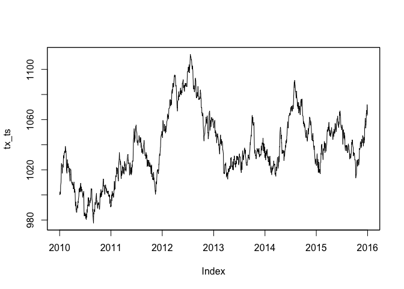
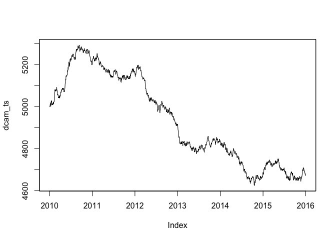
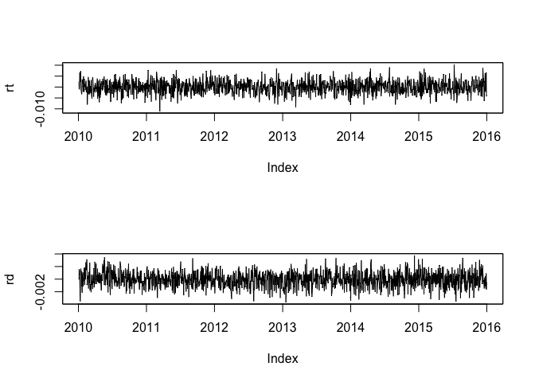
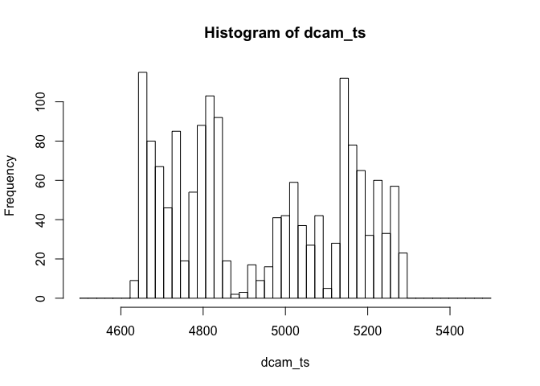
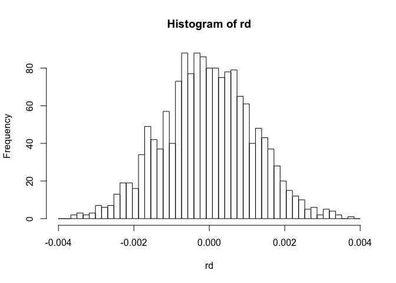
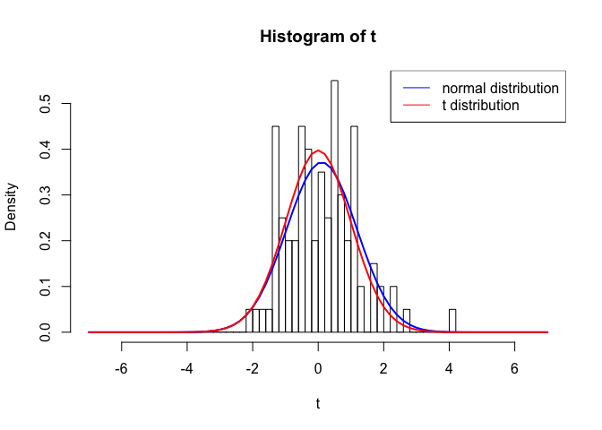
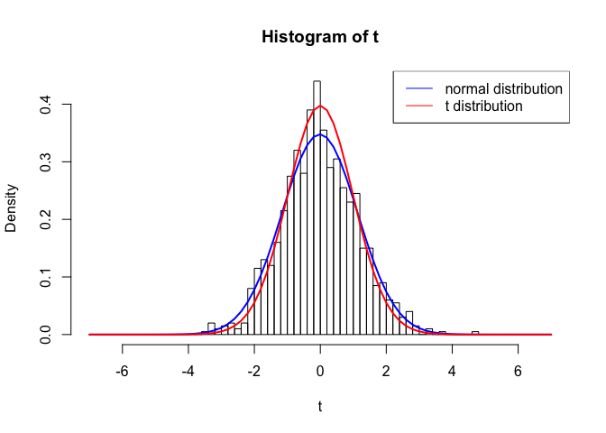
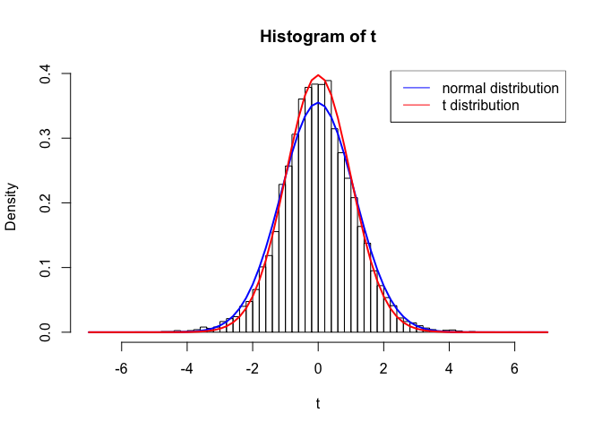
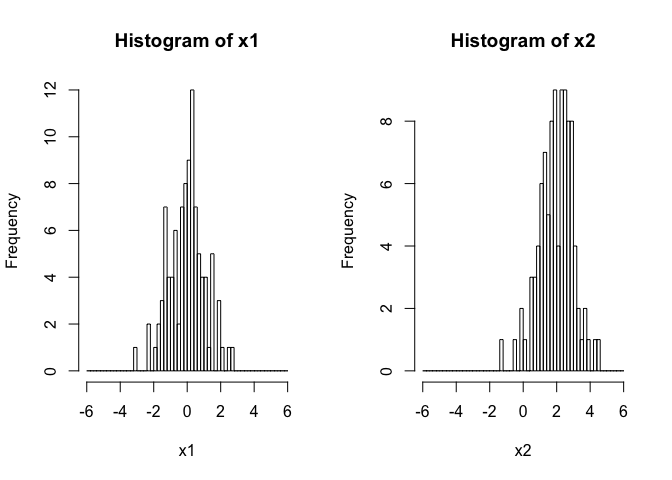
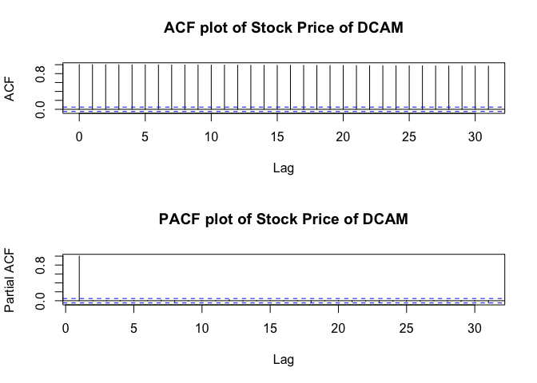

Preface
=======

This markdown covers 1.1-1.3 of book Eviewで学ぶ応用ファイナンス. (1.4
is about Kalman filter and it will be introduced in next time)

-   1.1 the fundamental knowledge of time series

-   1.2 model estimation by OLS

-   1.3 estimation of AR model

The eviews codes in book have been rewritten in R.

Necessary R packages
====================

``` r
library(knitr)
library(xtable)
library(bizdays)
library(zoo)
library(stats)
library(moments)
library(tseries)
```

Generating time series
----------------------

We not use real stock prices here but instead simulate two virtual stock
prices following unit root process for analysis.  
- Stock market index  
- Stock prices of DCAM  
Period: 2010-01-01\~2015-12-31 (only business day)

### Generating a date series

Firstly, we need to generate the data series from January 1st 2010 to
December 31th 2015, and since only business days in the period are
wanted, we use the create.calendar function from bizdays package.

``` r
create.calendar("business_day", weekdays=c("saturday", "sunday"))
series_date=bizseq("2010-01-01", "2015-12-31", "business_day")
length(series_date)
```

    ## [1] 1565

### Generating stock market index

Then, we are going to simulate a time series following unit root process
as stock market index.
*t**x*<sub>*t*</sub> = *t**x*<sub>*t* − 1</sub> + *u*<sub>2*t*</sub>, *u*<sub>2*t*</sub> ∼ *N*(0, 9)
Here are some functions about normal distribution:

``` r
rnorm(5,mean=0,sd=1) # random generation
```

    ## [1]  0.8392855  0.6409164 -1.1356431  1.2643960  0.8734462

``` r
dnorm(0,mean=0,sd=1) # probability density function
```

    ## [1] 0.3989423

``` r
pnorm(0,mean=0,sd=1) # cumulative distribution function
```

    ## [1] 0.5

``` r
qnorm(0.5,mean=0,sd=1) # quantile function
```

    ## [1] 0

We used rnorm of them to generate randoms numbers from a standard normal
distribution.

``` r
tx=1000
set.seed(123456)
random=rnorm(length(series_date))
for(i in 1:length(series_date)){
  tx=append(tx,tail(tx,1)+3*random[i])
  }
tx_ts=zoo(round(tx,2),order.by = series_date)
plot(tx_ts)
```



### Generating stock prices of DCAM

Then, we are going to simulate another time series also following unit
root process as stock prices of DCAM.
*d**c**a**m*<sub>*t*</sub> = *d**c**a**m*<sub>*t* − 1</sub> + *u*<sub>1*t*</sub>, *u*<sub>1*t*</sub> ∼ *N*(0, 36)

``` r
dcam=5000
set.seed(1111)
random_2=rnorm(length(series_date))
for(i in 1:length(series_date)){
  dcam=append(dcam,tail(dcam,1)+6*random_2[i])
}
dcam_ts=zoo(round(dcam,2),order.by = series_date)
plot(dcam_ts)
```



And here are return series of them that be calculated by first
difference in log.

``` r
rd=na.omit(diff(log(dcam_ts)))
rt=na.omit(diff(log(tx_ts)))
par(mfrow=c(2,1))
plot(rt)
plot(rd)
```



Descriptive statistics
----------------------

Next, we can check the descriptive statistics for series by using
function descriptive defined by ouselves. Here is the function:

``` r
descriptive=function(x){
  jb=tseries::jarque.bera.test(x)
  results=data.frame(
  'Mean'=mean(x),
  'Median'=median(x),
  'Maximum'=max(x),
  'Minimum'=min(x),
  'Std.Dev'=sd(x),
  'Skewness'=moments::skewness(x),
  'Kurtosis'=moments::kurtosis(x),
  'Jarque-Bera'=jb$statistic,
  'Probability'=jb$p.value)
  rownames(results)=NULL
  return(results)
}
```

Here are results of DCAM stock prices.

``` r
kable(descriptive(dcam_ts))
```

|      Mean|   Median|  Maximum|  Minimum|   Std.Dev|   Skewness|  Kurtosis|  Jarque.Bera|  Probability|
|---------:|--------:|--------:|--------:|---------:|----------:|---------:|------------:|------------:|
|  4937.195|  4908.59|  5294.09|  4625.41|  207.3339|  0.1414688|  1.528289|     146.4571|            0|

Here are results of DCAM stock returns.

``` r
kable(descriptive(rd))
```

|       Mean|     Median|    Maximum|     Minimum|    Std.Dev|   Skewness|  Kurtosis|  Jarque.Bera|  Probability|
|----------:|----------:|----------:|-----------:|----------:|----------:|---------:|------------:|------------:|
|  -4.35e-05|  -4.77e-05|  0.0037461|  -0.0036563|  0.0012091|  -0.012795|  2.926193|    0.3976685|    0.8196858|

Next, we are going to show the histogram of two series.  
Here is the histogram of DCAM stock prices.

``` r
hist(dcam_ts,breaks = seq(4500,5500,length.out=50),freq = T)
```



Here is the histogram of DCAM stock returns.

``` r
hist(rd,breaks = seq(-0.004,0.004,length.out=50),freq = T)
```



Single index model
------------------

Next, we try to fit a univariate linear regression model for return
series.

``` r
eq01=lm(rd~rt)
eq01_sum=summary(eq01)
kable(eq01_sum$coefficients)
```

|             |    Estimate|  Std. Error|     t value|  Pr(\>\|t\|)|
|:------------|-----------:|-----------:|-----------:|------------:|
| (Intercept) |  -0.0000432|   0.0000306|  -1.4131350|    0.1578153|
| rt          |  -0.0078868|   0.0105171|  -0.7499067|    0.4534238|

t-test
======

Testing a mean using t-test
---------------------------

In this section, we used two-tail t-test for if mean equal 0:
$$
\\begin{equation}\\nonumber
    H\_0:\\overline{X}=\\mu\_0,H\_1:\\overline{X}\\neq \\mu\_0
    \\end{equation}
$$

t-statistic:
$$
\\begin{equation}\\nonumber
    t=\\frac{\\overline{X}-\\mu\_0}{\\frac{s}{\\sqrt{n}}}
    \\end{equation}
$$

For more details on hypothesis testing please watch my vedio on bilibili
(chinese only):
<a href="https://support.rstudio.com/hc/en-us/articles/200486468" class="uri">https://support.rstudio.com/hc/en-us/articles/200486468</a>.

Conducting t-test in R by using t.test function:

``` r
t.test(rd,mu=0)
```

    ## 
    ##  One Sample t-test
    ## 
    ## data:  rd
    ## t = -1.4236, df = 1563, p-value = 0.1548
    ## alternative hypothesis: true mean is not equal to 0
    ## 95 percent confidence interval:
    ##  -1.034958e-04  1.644553e-05
    ## sample estimates:
    ##     mean of x 
    ## -4.352512e-05

t statics and p-value can be calculated by ourselves.

``` r
mu=mean(rd)
sd=sd(rd)
obs=length(rd)
h0=0
t=(mu-h0)/(sd/sqrt(obs))
p=pt(t,(obs-1))*2 #p=1-pt(t,(obs-1))*2, if t>0
c('t-value'=t,'p-value'=p)
```

    ##   t-value   p-value 
    ## -1.423593  0.154764

Illustration of central limit theorem using Monte-Carlo Simulation
------------------------------------------------------------------

### Central limit theorem

The central limit theorem states that if you have a population with mean
μ and standard deviation σ and take sufficiently large random samples
from the population with replacementtext annotation indicator, then the
distribution of the sample means will be approximately normally
distributed.

-   Central limit theorem  
    If *X*<sub>1</sub>, *X*<sub>2</sub>, …, *X*<sub>*n*</sub> are random
    samples and *i*.*i*.*d*  (*μ*, *σ*<sup>2</sup>), then:  
    $Y\_n=\\frac{\\sqrt{\\hat{X}-\\mu}}{\\sigma}$,where
    $\\overline{X}\_n=\\frac{\\sum^{n}\_{i=1}X\_i}{n}$,  
    $s.t. \\quad Y\_n \\overset{D}{\\rightarrow} N(0,1)$

### Monte-Carlo Simulation

Monte Carlo methods, or Monte Carlo experiments, are a broad class of
computational algorithms that rely on repeated random sampling to obtain
numerical results.

``` r
obs=10
mu=170
sd=5
reps=100 #try 1000,10000
hgt=c()
m=c()
se=c()
t=c()
set.seed(1234)
random_3=matrix(rnorm(reps*obs),reps,obs)
for(i in 1:reps){
  for(j in 1:obs){
    hgt[j]=random_3[i,j]*sd+mu
  }
  m[i]=mean(hgt)
  se[i]=sd(hgt)/sqrt(obs)  
  t[i]=(mu-m[i])/se[i]
}
hist(t,breaks = seq(-7,7,0.2),freq = F)
xfit=seq(-7,7,0.2)
yfit_1<-dnorm(xfit,mean=mean(t),sd=sd(t)) 
lines(xfit, yfit_1, col="blue", lwd=2) 
yfit_2<-dt(xfit,length(xfit)-1) 
lines(xfit, yfit_2, col="red", lwd=2) 
legend(x = "topright", legend=c("normal distribution", "t distribution"),
       col=c("blue", "red"),lty=c(1,1),cex=1)
```



when reps=1000:  


when reps=10000:  


t-test for parameter in eq01
----------------------------

``` r
kable(eq01_sum$coefficients)
```

|             |    Estimate|  Std. Error|     t value|  Pr(\>\|t\|)|
|:------------|-----------:|-----------:|-----------:|------------:|
| (Intercept) |  -0.0000432|   0.0000306|  -1.4131350|    0.1578153|
| rt          |  -0.0078868|   0.0105171|  -0.7499067|    0.4534238|

``` r
b=eq01$coefficients[2]
se=eq01_sum$coefficients[2,2]
df=eq01$df.residual
t=(b-0)/se
p=pt(t,(df-1))*2
c('t-value'=t,'p-value'=p)
```

    ## t-value.rt p-value.rt 
    ## -0.7499067  0.4534239

Coefficient of determination
============================

*Y*<sub>*i*</sub> = *α* + *β**X*<sub>*i*</sub> + *u*<sub>*i*</sub>
It has:
$$
\\begin{equation}\\nonumber
    \\hat{Y}\_i=\\hat{\\alpha}+\\hat{\\beta}X\_i, \\overline{Y}=\\hat{\\alpha}+\\hat{\\beta}\\overline{X}
    \\end{equation}
$$
Coefficient of determination：
$$
\\begin{equation}\\nonumber
R^2=\\frac{\\sum (\\hat{Y}\_i-\\overline{Y})^2}{\\sum (Y\_i-\\overline{Y})^2}
    \\end{equation}
$$
Adjusted coefficient of determination：
$$
\\begin{equation}\\nonumber
adj R^2=1-(1-R^2)\\frac{n-1}{n-k}
    \\end{equation}
$$

We can check *R*<sup>2</sup> and *a**d**j**R*<sup>2</sup> by using
summary function easily:

``` r
summary(eq01)
```

    ## 
    ## Call:
    ## lm(formula = rd ~ rt)
    ## 
    ## Residuals:
    ##        Min         1Q     Median         3Q        Max 
    ## -0.0035931 -0.0007800 -0.0000106  0.0008141  0.0037715 
    ## 
    ## Coefficients:
    ##               Estimate Std. Error t value Pr(>|t|)
    ## (Intercept) -4.322e-05  3.058e-05  -1.413    0.158
    ## rt          -7.887e-03  1.052e-02  -0.750    0.453
    ## 
    ## Residual standard error: 0.001209 on 1562 degrees of freedom
    ## Multiple R-squared:  0.0003599,  Adjusted R-squared:  -0.0002801 
    ## F-statistic: 0.5624 on 1 and 1562 DF,  p-value: 0.4534

Log-likelihood
==============

The likelihood function (often simply called the likelihood) measures
the goodness of fit of a statistical model to a sample of data for given
values of the unknown parameters.

``` r
set.seed(111)
random_4=matrix(rnorm(200),100,2)
x1=random_4[,1]
x2=random_4[,2]+2
den1=dnorm(x1)
den2=dnorm(x2)
logl1=sum(log(den1))
logl2=sum(log(den2))
logl1
```

    ## [1] -148.6652

``` r
logl2
```

    ## [1] -339.9499

Histogram of two series
-----------------------

``` r
par(mfrow=c(1,2))
hist(x1,breaks = seq(-6,6,0.2),freq = T)
hist(x2,breaks = seq(-6,6,0.2),freq = T)
```



Log-likelihood calculation of eq01
----------------------------------

``` r
robs=length(eq01$fitted.values)
k=2
e2=(eq01$residuals)^2
#likelihood
logl=-(robs/2)*(1+log(2*pi)+log(sum(e2)/robs))
logLik(eq01)
```

    ## 'log Lik.' 8288.287 (df=3)

``` r
logl
```

    ## [1] 8288.287

Information criterion
=====================

Akaike information criterion (AIC)
----------------------------------

-   AIC in Eviews:
    *A**I**C* =  − 2(*l*/*T*) + 2(*k*/*T*)
      
-   AIC in R:
    *A**I**C* =  − 2*l* + 2*k*

``` r
aic=-2*logl+2*k 
aic_2=AIC(eq01) 
aic_3=-2*logl/robs+2*k/robs
c(aic,aic_2,aic_3)
```

    ## [1] -16572.57422 -16570.57422    -10.59628

Bayesian information criterion (BIC)
------------------------------------

-   BIC in Eviews:
    *B**I**C* =  − 2(*l*/*T*) + *k**l**o**g*(*T*)/*T*
      
-   BIC in R:
    *B**I**C* =  − 2*l* + *k**l**o**g*(*T*)

``` r
bic=-2*logl+log(robs)*k
bic_2=BIC(eq01)
bic_3=-2*logl/robs+log(robs)*k/robs
c(bic,bic_2,bic_3)
```

    ## [1] -16561.86422 -16554.50921    -10.58943

Hannan–Quinn information criterion (HQC)
----------------------------------------

-   HQC in Eviews:
    *H**Q* =  − 2(*l*/*T*) + 2*k**l**o**g*(*l**o**g*(*T*))/*T*

``` r
hq=-2*logl/robs+2*k*log(log(robs))/robs
hq
```

    ## [1] -10.59373

ACF and PACF
============

-   Autocorrelation Function (ACF):
    $$
    \\begin{equation}\\nonumber
      \\rho\_k=\\frac{\\sum\_{t=k+1}^{T}(Y\_t-\\overline{Y})(Y\_{t-k}-\\overline{Y})}{\\sum\_{t=1}^{T}(Y\_t-\\overline{Y})^2}
      \\end{equation}
    $$
      
-   Partial Autocorrelation Function (PACF):  
    The partial autocorrelation function is a measure of the correlation
    between observations of a time series that are separated by k time
    units (*y*<sub>*t*</sub> and *y*<sub>*t*–*k*</sub>), after adjusting
    for the presence of all the other terms of shorter lag
    (*y*<sub>*t*–1</sub>, *y*<sub>*t*–2</sub>, ..., *y*<sub>*t*–*k*–1</sub>).

ACF and PACF of DCAM stock prices
---------------------------------

``` r
par(mfrow=c(2,1))
acf(dcam,main='ACF plot of Stock Price of DCAM')
pacf(dcam,main='PACF plot of Stock Price of DCAM')
```



Ljung-Box test
==============

The Ljung–Box test is a type of statistical test of whether any of a
group of autocorrelations of a time series are different from zero.
$$
\\begin{equation}\\nonumber
    H\_0:\\rho\_1=\\rho\_2=\\dots=\\rho\_m=0\\\\
    H\_1:\\exists k\\in \[1,m\], \\quad s.t. \\quad \\rho\_k \\neq 0
    \\end{equation}
$$
Q-statistic:
$$
\\begin{equation}\\nonumber
    Q(m)=T(T+2)\\sum\_{k=1}^{m}\\frac{{\\hat{\\rho}\_k}^2}{T-k} \\sim \\chi^2(m)
    \\end{equation}
$$

We can conduct Ljung–Box test in R by using Box.test function:

``` r
for( i in 1:13){
LB_test=Box.test(dcam_ts, lag = i, type ="Ljung-Box")
print(c(i,round(unname(LB_test$statistic),2),LB_test$p.value))
}
```

    ## [1]    1.00 1563.64    0.00
    ## [1]    2.00 3124.31    0.00
    ## [1]    3.00 4682.83    0.00
    ## [1]    4.00 6238.81    0.00
    ## [1]    5.00 7791.44    0.00
    ## [1]    6.00 9344.37    0.00
    ## [1]     7.00 10899.36     0.00
    ## [1]     8.00 12447.56     0.00
    ## [1]     9.00 13987.09     0.00
    ## [1]    10.00 15524.74     0.00
    ## [1]    11.00 17059.97     0.00
    ## [1]    12.00 18591.62     0.00
    ## [1]    13.00 20129.24     0.00

AR model
========

Fitting AR model by ordinary least squares
------------------------------------------

Considering a AR(1) model for DCAM stock prices:
*d**c**a**m*<sub>*t*</sub> = *β*<sub>0</sub> + *β*<sub>1</sub>*d**c**a**m*<sub>*t* − 1</sub> + *u*<sub>*t*</sub>

The function ar.ols allows us to fit an autoregressive time series model
to the data by ordinary least squares, by default selecting the
complexity by AIC in R.

``` r
ar.ols(dcam, 
       order.max = 1, 
       demean = F, 
       intercept = T)
```

    ## 
    ## Call:
    ## ar.ols(x = dcam, order.max = 1, demean = F, intercept = T)
    ## 
    ## Coefficients:
    ##      1  
    ## 1.0001  
    ## 
    ## Intercept: -0.6776 (3.586) 
    ## 
    ## Order selected 1  sigma^2 estimated as  35.4

Fitting AR(1) model using AR term:
----------------------------------

``` r
#estimated by using conditional-sum-of-squares
AR1_1<- arima(dcam_ts, order = c(1,0,0),method='CSS')
AR1_1
```

    ## 
    ## Call:
    ## arima(x = dcam_ts, order = c(1, 0, 0), method = "CSS")
    ## 
    ## Coefficients:
    ##          ar1  intercept
    ##       1.0003   4937.201
    ## s.e.     NaN        NaN
    ## 
    ## sigma^2 estimated as 34.8:  part log likelihood = -4998.25

``` r
#estimated by using maximum likelihood
AR1_2 <- arima(dcam_ts, order = c(1,0,0),method='ML')
AR1_2
```

    ## 
    ## Call:
    ## arima(x = dcam_ts, order = c(1, 0, 0), method = "ML")
    ## 
    ## Coefficients:
    ##          ar1  intercept
    ##       0.9996  4936.2122
    ## s.e.  0.0004   190.3864
    ## 
    ## sigma^2 estimated as 30.38:  log likelihood = -5067.29,  aic = 10140.59
